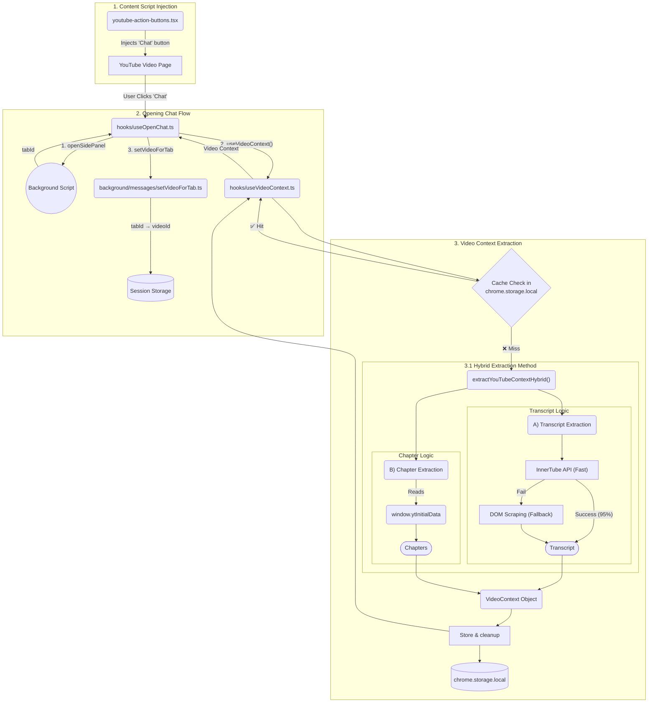
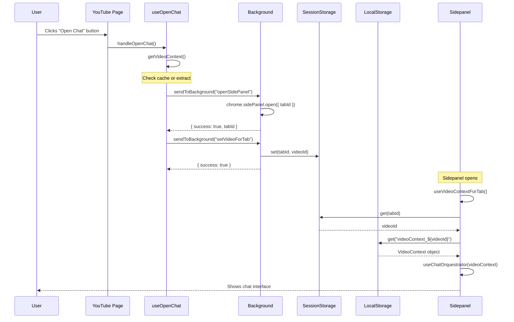
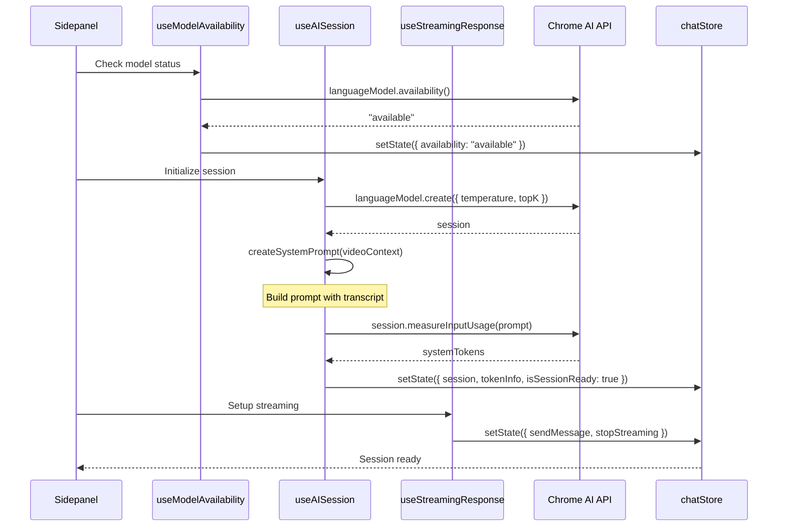

# System Architecture Overview

This document provides a comprehensive overview of the Nano Tutor system architecture, data flow, and component interactions.

## Architecture Visualization



## Core Flow

The extension follows a three-phase flow:

### Phase 1: Chat Initiation

1. **User on YouTube page clicks "Open Chat" button**
2. **Content script** (`youtube-action-buttons.tsx`) handles click
3. **useOpenChat hook** coordinates the opening sequence

### Phase 2: Video Context Extraction

1. **Cache check**: Look for `videoContext_${videoId}` in local storage
2. **On cache hit**: Return instantly (no extraction needed)
3. **On cache miss**: Extract using hybrid method:
   - **Transcript**: InnerTube API (fast) with DOM scraping fallback
   - **Chapters**: Parse `window.ytInitialData` object
4. **Store** complete VideoContext object (~50-500KB)
5. **Cleanup**: Remove oldest cached videos (keep most recent 3)

### Phase 3: Sidepanel Initialization

1. **Background script** opens sidepanel for the tab
2. **Tab→Video mapping** stored in session storage
3. **Sidepanel** retrieves video context using tab ID
4. **AI session** initialized with transcript as system prompt
5. **UI renders** with video information and chat interface

## Component Interaction Overview

### Content Script Layer
- **youtube-action-buttons.tsx**: Injects chat button into YouTube UI
- **useOpenChat hook**: Coordinates extraction and sidepanel opening

### Background Script Layer
- **Event listeners**: Manage sidepanel enable/disable based on URL
- **Message handlers**: `openSidePanel`, `setVideoForTab`
- **Tab lifecycle**: Track tab closes, video navigation changes

### Sidepanel Layer
- **Entry point**: `sidepanel.tsx`
- **Video context**: `useVideoContextForTab` retrieves cached context
- **Chat orchestrator**: `useChatOrquestrator` initializes AI session
- **UI components**: Render video info, chat interface, chapters

### State Management Layer
- **chatStore**: Messages, AI session, model availability, tokens
- **chapterStore**: Chapter selection state

## Opening Chat Sequence



## AI Session Initialization Sequence



## Data Flow Visualization

### Video Context Flow

```
YouTube Page DOM
    ↓
Extraction Functions
    ├→ InnerTube API (transcript)
    ├→ window.ytInitialData (chapters)
    └→ DOM selectors (title, channel)
    ↓
VideoContext Object {
  videoId, transcript,
  title, channel, chapters
}
    ↓
chrome.storage.local (cache)
    ↓
Sidepanel retrieval
    ↓
AI Session (system prompt)
```

### Message Flow

```
User Input
    ↓
ChatInput component
    ↓
chatStore.sendMessage()
    ↓
session.promptStreaming()
    ↓
Streaming chunks (throttled 60 FPS)
    ↓
chatStore.updateLastMessage()
    ↓
MessageList component
    ↓
User sees response
```

## Storage Architecture

### Two-Tier Strategy

**Session Storage** (`chrome.storage.session`):
- **Purpose**: Temporary tab→video mapping
- **Lifetime**: Cleared on tab close
- **Size**: Minimal (just videoId strings)
- **Enables**: Multi-tab support

**Local Storage** (`chrome.storage.local`):
- **Purpose**: Persistent video context cache
- **Lifetime**: Survives browser restart
- **Size**: ~50-500KB per video
- **Enables**: Instant retrieval on revisit

**Cleanup Strategy**:
- Maintains most recent 3 videos
- Runs before saving new video context
- Prevents storage quota issues (10MB limit)

See [storage.md](storage.md) for detailed documentation.

## AI Session Lifecycle

### 1. Model Availability Check

```typescript
const status = await self.ai.languageModel.availability()
// "available" | "downloadable" | "downloading" | "unavailable"
```

If downloadable, user can trigger download with progress tracking.

### 2. Session Creation

```typescript
const session = await self.ai.languageModel.create({
  temperature: 1,
  topK: 3
})
```

### 3. System Prompt Injection

```typescript
const prompt = `You are an assistant for the video: "${title}".

Here is the transcript:

${transcript}` // Truncated to 80% of quota if needed

await session.append([{ role: "system", content: prompt }])
```

### 4. Token Tracking

- **System tokens**: Transcript (uses ~80% of quota)
- **Conversation tokens**: User + assistant messages (~20% of quota)
- **Visual indicator**: Circular progress on reset button
- **Reset**: Destroy session and create new one when approaching limit

### 5. Message Streaming

```typescript
const stream = await session.promptStreaming(text, { signal })

for await (const chunk of stream) {
  // Throttled updates (60 FPS)
  updateMessage(chunk)
}
```

## Key Design Decisions

### Why Sidepanel vs. Popup?

**Sidepanel chosen because**:
- Stays open while browsing
- Persists across page navigations
- Better for chat interface (context preserved)
- Chrome 114+ required

### Why Two-Tier Storage?

**Session + Local storage chosen because**:
- Session enables multi-tab (tab-specific mapping)
- Local enables caching (video-specific data)
- Clean separation of concerns
- Automatic cleanup (session on tab close, local on storage limit)

### Why Hybrid Extraction?

**InnerTube API + DOM fallback chosen because**:
- API is fast (~100-300ms) with high success rate (~95%)
- DOM fallback covers edge cases
- Combined approach achieves ~99%+ success rate

### Why Zustand for State Management?

**Zustand chosen because**:
- No provider wrapper needed
- Minimal boilerplate
- Selective subscriptions (optimized re-renders)
- DevTools support
- TypeScript-first

### Why 60 FPS Throttling?

**Throttling chosen because**:
- AI streams very fast (hundreds of tokens/second)
- Updating DOM on every chunk causes performance issues
- 60 FPS (16ms) is smooth for human perception
- Final force-update ensures accuracy

## Related Documentation

- **[Storage Details](storage.md)** - Two-tier storage strategy
- **[Design Patterns](design-patterns.md)** - Key patterns used
- **[Background Script](../components/background.md)** - Background implementation
- **[React Hooks](../components/hooks.md)** - Hook orchestration
- **[YouTube Extraction](../components/yt-extraction.md)** - Extraction details
