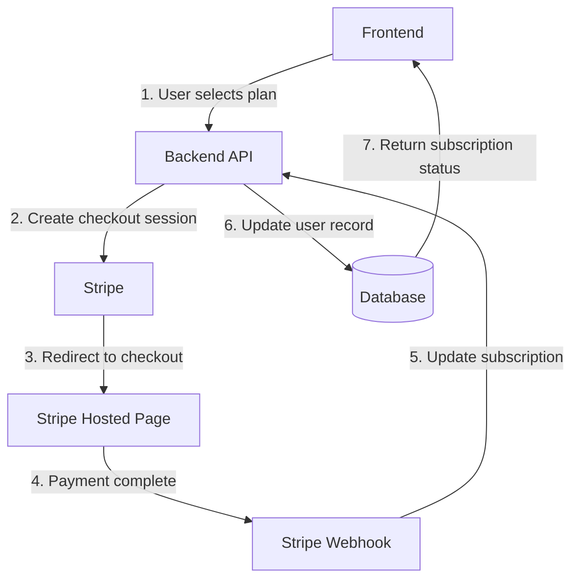
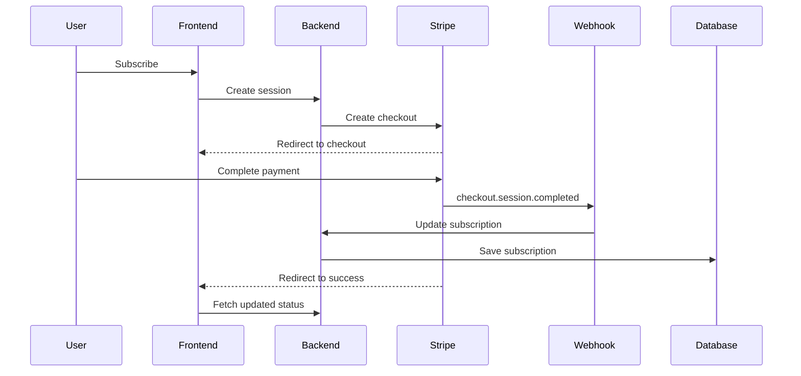
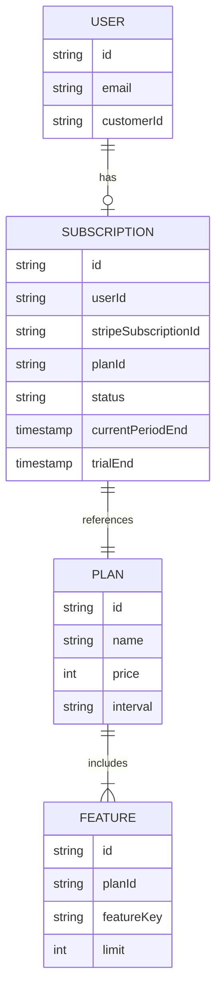
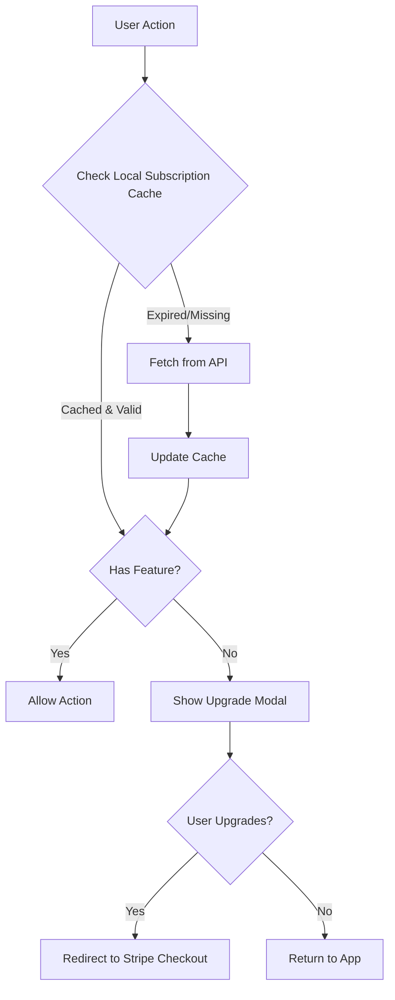

# Paid Features Implementation Guide (2025)

## Overview

Industry best practices for integrating Stripe payments and managing feature access control in modern applications.

## 1. Stripe Payment Integration

### Architecture Pattern

### 1.1 Checkout Session Pattern

**Use Stripe Checkout (hosted UI)** instead of implementing custom payment forms. This offloads PCI DSS compliance, fraud detection, and cross-platform payment optimization to Stripe's infrastructure. The checkout session should include customer email pre-fill, client reference IDs linking to internal user records, and metadata for webhook processing.

**Session configuration:** Use `subscription` mode for recurring billing. Reference Price IDs (not hardcoded amounts) to enable dynamic pricing updates without code changes. Configure success/cancel URLs with session ID interpolation for post-payment state reconciliation.

### 1.2 Webhook-Driven State Management

**Critical principle:** Application state updates must be driven exclusively by Stripe webhooks, not client-side success callbacks. The success URL redirect is purely for UX; all database mutations occur via webhook handlers.

**Essential webhook events:**
- `checkout.session.completed` - Initial subscription creation
- `customer.subscription.updated` - Plan changes, renewals
- `customer.subscription.deleted` - Cancellations
- `invoice.paid` - Successful recurring payments
- `invoice.payment_failed` - Dunning management triggers
- `customer.subscription.trial_will_end` - Trial expiration warnings

### 1.3 Idempotency

All Stripe API calls that create resources (payment intents, checkout sessions, subscriptions) must include idempotency keys to prevent duplicate operations during network retries. Key format should combine stable identifiers (user ID) with operation-specific context (timestamp, resource type).

### 1.4 Product-Price Separation

**Modern pattern:** Products represent the service offered; Prices represent billing variations. A single Product (e.g., "Pro Plan") has multiple Price entities (monthly $10, yearly $100). This architecture enables:
- Multi-currency support without product duplication
- A/B testing different price points
- Promotional pricing without changing core product definitions
- Billing interval flexibility

### 1.5 Self-Service Portal

Stripe's Customer Portal handles subscription management (upgrades, downgrades, cancellations, payment method updates) without custom backend implementation. Portal sessions are created server-side with customer ID and return URL, then consumed client-side as a redirect.

## 2. Feature Management Architecture

### 2.1 Data Model

**Core entities:**
- **User:** Application account with reference to Stripe Customer ID
- **Subscription:** Links user to plan with Stripe subscription ID, status (`active`, `trialing`, `past_due`, `canceled`), and period metadata
- **Plan:** Tier definition (free/pro/enterprise) with pricing and interval
- **Feature:** Plan-specific capabilities and quotas

### 2.2 Feature Matrix Pattern

Define a configuration object mapping plan tiers to feature availability and resource limits. This serves as the single source of truth for access control decisions. Features are boolean flags (enabled/disabled) or numeric limits (quotas).

**Structure:** Nested object with plan IDs as keys containing feature flags and limit definitions. Use TypeScript `const` assertions for type safety and IntelliSense.

### 2.3 Access Control Implementation

**Backend middleware pattern:** Feature guard class provides authorization methods:
- `hasFeature(userId, featureName)` - Boolean check for feature availability
- `checkLimit(userId, resource, currentUsage)` - Quota enforcement
- `getEffectivePlan(userId)` - Resolve current plan considering subscription status and grace periods

**Subscription status resolution:**
1. No subscription → free tier
2. `active` or `trialing` status → entitled tier
3. `past_due` within grace period → maintain access (3-7 days typical)
4. `canceled` before period end → maintain access until expiration
5. Default fallback → free tier

**API integration:** Apply feature guards as middleware before protected route handlers. Return 403 with upgrade metadata on authorization failures.

### 2.4 Frontend Feature Gating

**Client-side pattern:** React hook or service layer consuming subscription context. Memoize feature checks to prevent recalculation on every render. Cache subscription data with TTL (5-15 minutes) to reduce API calls.

**UI treatment:** Conditionally render upgrade prompts for disabled features. Use visual indicators (lock icons, blur effects, disabled states) for gated functionality. Provide upgrade CTAs with context about specific features being accessed.

**Critical:** Client-side checks are UX-only. All authorization enforcement occurs server-side to prevent bypass.

### 2.5 Graceful Degradation

**Grace period pattern:** When payment fails (`past_due` status), maintain access for 3-7 days while dunning emails attempt recovery. This prevents immediate service disruption from temporary payment issues.

**Cancellation handling:** Users retaining access until current period end (already paid through that date) improves perceived fairness.

**Downgrade transitions:** When subscription ends, gracefully handle resource limits by making content read-only rather than inaccessible. Example: Exceeding project limit prevents creation but allows viewing existing projects.

## 3. Security Requirements

### 3.1 Webhook Verification

**Mandatory:** Validate webhook signatures using Stripe's SDK and secret key. Reject any webhook without valid signature to prevent spoofed events from unauthorized sources. Use raw request body (not parsed JSON) for signature verification.

### 3.2 Server-Side Authorization

**Principle:** Never trust client-supplied subscription status. Always query current subscription state from database or Stripe API before authorizing protected operations.

**Anti-pattern:** Client sending `isPro: true` in request payload.  
**Correct pattern:** Server independently verifying plan entitlement from authenticated user ID.

### 3.3 Rate Limiting by Tier

Apply different rate limits based on subscription tier. Free users receive restrictive limits; paid tiers receive progressively higher quotas. Implement using distributed cache (Redis) with user-scoped keys and time-window expiration.

## 4. Testing Strategy

**Stripe test mode:** Use separate API keys for development/staging environments. Test mode provides simulated payment flows without real transactions.

**Test clocks:** Stripe's test helper API allows time manipulation for testing subscription lifecycle events (renewals, expirations, dunning) without waiting for real-time passage.

**Webhook simulation:** Trigger webhook events manually via Stripe dashboard or CLI for integration testing.

## 5. Advanced Patterns

### Usage-Based Billing
Track consumption via Stripe's Usage Records API. Increment subscription item usage throughout billing cycle; Stripe calculates charges based on accumulated usage at invoice generation.

### Free Trials
Configure trial period days in subscription creation. Set trial ending behavior (auto-cancel vs require payment method). Handle `trial_will_end` webhook for conversion notifications.

### Proration
Stripe automatically calculates prorated charges when users upgrade/downgrade mid-cycle. Configure proration behavior (`create_prorations` for immediate charges, `none` for next invoice cycle).

## 6. Key Principles

> [!IMPORTANT]
> **Architectural Requirements**
> 1. **Webhook-driven updates** - All state changes originate from Stripe webhooks
> 2. **Cryptographic verification** - Validate all webhook signatures
> 3. **Server-side enforcement** - Client authorization checks are UX-only
> 4. **Hosted checkout** - Use Stripe Checkout for PCI compliance
> 5. **Grace periods** - Implement payment failure tolerance
> 6. **Subscription caching** - Cache with TTL to reduce database load
> 7. **Backend feature matrix** - Centralized access control configuration

> [!WARNING]
> **Common Vulnerabilities**
> - Client-side subscription validation as authorization
> - Missing webhook signature verification
> - Non-idempotent webhook handlers (duplicate processing)
> - No grace period for payment failures
> - Inadequate subscription lifecycle event coverage
