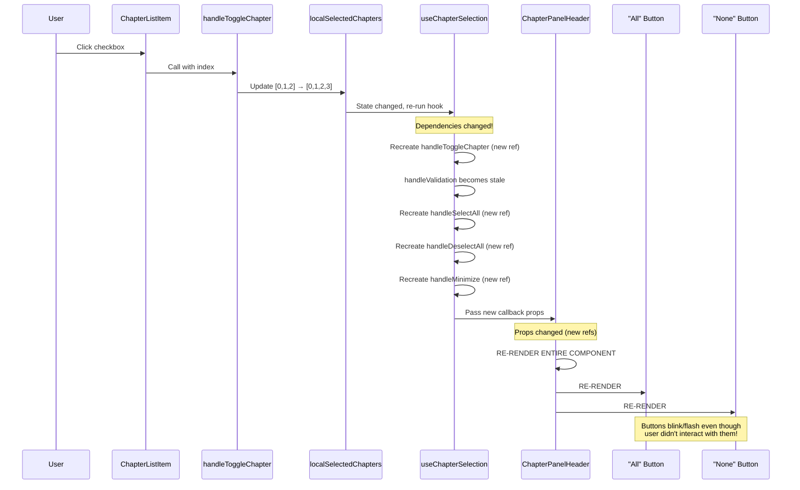
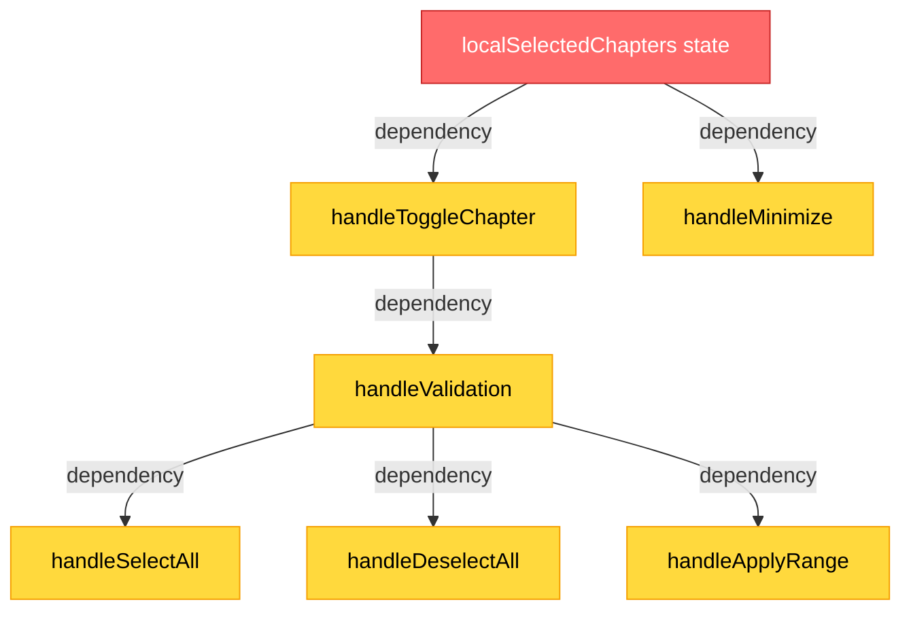
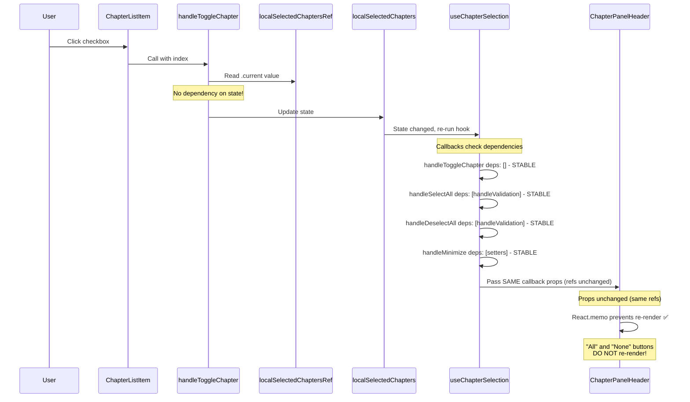
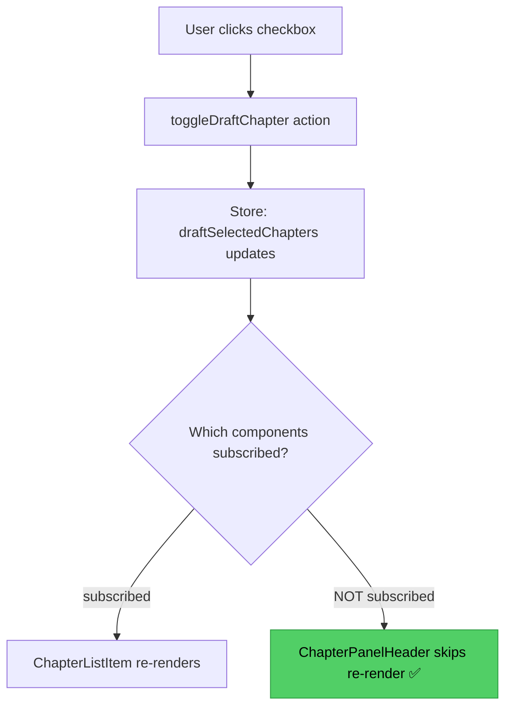
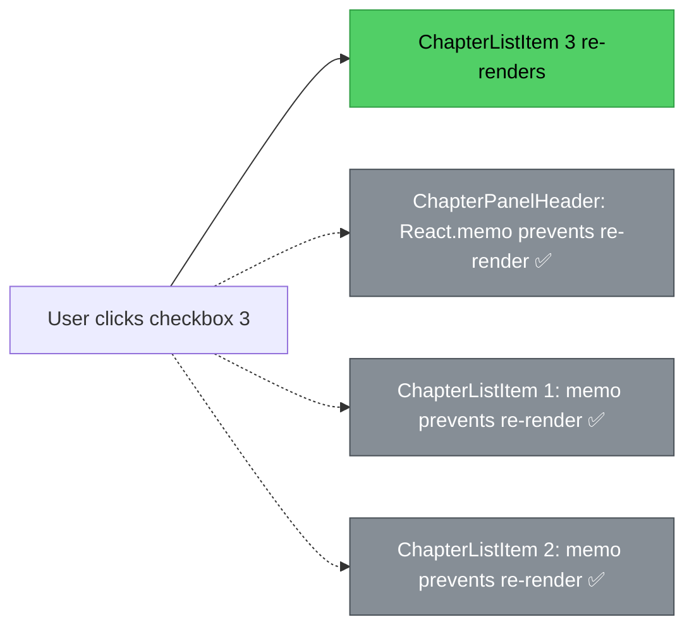

# Chapter Selection Re-rendering Issue

## Table of Contents
1. [React Re-rendering Fundamentals](#react-re-rendering-fundamentals)
2. [Current Implementation Analysis](#current-implementation-analysis)
3. [The Problem: Cascade Re-rendering](#the-problem-cascade-re-rendering)
4. [Root Cause Deep Dive](#root-cause-deep-dive)
5. [Solution Approaches](#solution-approaches)
6. [Solution Comparison](#solution-comparison)
7. [Recommended Implementation](#recommended-implementation)

---

## React Re-rendering Fundamentals

### When Does React Re-render?

React components re-render when:

1. **State changes** - Component's own state updates via `useState` or `useReducer`
2. **Props change** - Parent passes different prop values
3. **Parent re-renders** - By default, all children re-render when parent re-renders
4. **Context changes** - Component consumes context that updates

### Props Comparison & Referential Equality

**Key Concept:** React uses **shallow comparison** to detect prop changes.

```typescript
// Primitive values - compared by value
const count1 = 5;
const count2 = 5;
count1 === count2  // true - no re-render

// Objects/Functions - compared by reference
const func1 = () => {};
const func2 = () => {};
func1 === func2  // false - TRIGGERS RE-RENDER

const obj1 = { count: 5 };
const obj2 = { count: 5 };
obj1 === obj2  // false - TRIGGERS RE-RENDER
```

**Even if two functions have identical code, they're different objects in memory.**

### useCallback Dependency Array

`useCallback` memoizes a function, returning the **same reference** until dependencies change:

```typescript
// WITHOUT useCallback - new function every render
const handleClick = () => { console.log(count); };

// WITH useCallback - stable reference
const handleClick = useCallback(
  () => { console.log(count); },
  [count]  // recreate only when count changes
);
```

**Critical Rule:** When dependencies change → new function created → new reference → props change → child re-renders

---

## Current Implementation Analysis

### Component Hierarchy

```
ChapterSelectionPanel (parent)
├── ChapterPanelHeader
│   ├── Minimize button
│   ├── "All" button ← RE-RENDERS UNNECESSARILY
│   ├── "None" button ← RE-RENDERS UNNECESSARILY
│   └── Range input
└── ChapterListItem (multiple)
    └── Checkbox ← USER CLICKS HERE
```

### Hook Structure: useChapterSelection

**File:** `src/hooks/chapters/useChapterSelection.ts`

```typescript
export function useChapterSelection() {
  // LOCAL STATE - changes on every checkbox click
  const [localSelectedChapters, setLocalSelectedChapters] = useState<number[]>([]);

  // CALLBACK 1 - User clicks checkbox
  const handleToggleChapter = useCallback(
    (chapterIndex: number) => {
      const newSelection = /* toggle logic */;
      handleValidation(newSelection);  // calls async validation
    },
    [localSelectedChapters, handleValidation]  // ⚠️ PROBLEM: depends on state
  );

  // CALLBACK 2 - Validation wrapper
  const handleValidation = useCallback(
    (indices: number[]) => {
      validateSelection(indices, setLocalSelectedChapters);
    },
    [validateSelection, setLocalSelectedChapters]
  );

  // CALLBACK 3 - Select All
  const handleSelectAll = useCallback(
    () => {
      const allIndices = [...Array(chapters.length).keys()];
      handleValidation(allIndices);
    },
    [chapters.length, handleValidation]  // ⚠️ depends on handleValidation
  );

  // CALLBACK 4 - Deselect All
  const handleDeselectAll = useCallback(
    () => {
      handleValidation([]);
    },
    [handleValidation]  // ⚠️ depends on handleValidation
  );

  // CALLBACK 5 - Minimize
  const handleMinimize = useCallback(
    () => {
      setSelectedChapters(localSelectedChapters);
      togglePanel();
    },
    [localSelectedChapters, setSelectedChapters, togglePanel]  // ⚠️ depends on state
  );

  return {
    localSelectedChapters,
    handleToggleChapter,
    handleSelectAll,
    handleDeselectAll,
    handleMinimize,
    // ...
  };
}
```

### Component Props Flow

**ChapterSelectionPanel** → **ChapterPanelHeader**

```typescript
// ChapterSelectionPanel.tsx
<ChapterPanelHeader
  selectedCount={localSelectedChapters.length}
  totalCount={chapters.length}
  validationInProgress={validationInProgress}
  onMinimize={handleMinimize}        // ⚠️ new reference on state change
  onSelectAll={handleSelectAll}      // ⚠️ new reference on state change
  onDeselectAll={handleDeselectAll}  // ⚠️ new reference on state change
  onApplyRange={handleApplyRange}    // ⚠️ new reference on state change
/>
```

**ChapterSelectionPanel** → **ChapterListItem**

```typescript
// ChapterSelectionPanel.tsx
chapters.map((chapter, index) => (
  <ChapterListItem
    key={chapter.title}
    chapter={chapter}
    isSelected={localSelectedChapters.includes(index)}
    onToggle={handleToggleChapter}  // ⚠️ new reference on state change
    disabled={validationInProgress}
  />
))
```

---

## The Problem: Cascade Re-rendering

### What Happens When User Clicks a Checkbox



### Visual Dependency Chain

```
User clicks checkbox
    ↓
localSelectedChapters: [0,1,2] → [0,1,2,3]
    ↓
useChapterSelection re-runs
    ↓
handleToggleChapter dependencies changed (localSelectedChapters)
    ↓
handleToggleChapter RECREATED (new reference)
    ↓
handleValidation depends on handleToggleChapter
    ↓
handleValidation RECREATED (new reference)
    ↓
handleSelectAll depends on handleValidation
    ↓
handleSelectAll RECREATED (new reference)
    ↓
handleDeselectAll depends on handleValidation
    ↓
handleDeselectAll RECREATED (new reference)
    ↓
handleMinimize depends on localSelectedChapters
    ↓
handleMinimize RECREATED (new reference)
    ↓
ChapterPanelHeader receives new props (all callbacks changed)
    ↓
ChapterPanelHeader RE-RENDERS
    ↓
"All" button RE-RENDERS
"None" button RE-RENDERS
Range input RE-RENDERS
```

### Performance Impact

**Every single checkbox click triggers:**

1. ✅ **Expected:** 1 ChapterListItem re-render (the one clicked)
2. ❌ **Unexpected:** ChapterPanelHeader re-render
3. ❌ **Unexpected:** All buttons inside header re-render
4. ❌ **Unexpected:** Range input re-renders
5. ❌ **Unexpected:** ALL ChapterListItem components re-render (because `onToggle` prop changed)

**Example:** Video with 20 chapters
- User clicks 1 checkbox
- **Result:** 25+ component re-renders (1 panel header + 20 list items + buttons/inputs)
- **Should be:** 1 component re-render (just the clicked item)

---

## Root Cause Deep Dive

### The Dependency Chain Reaction

The issue stems from **callback interdependencies** with **state in dependency arrays**.



**Key:** When `localSelectedChapters` (red) changes, ALL yellow callbacks recreate.

### Code Analysis: The Problematic Pattern

**File:** `src/hooks/chapters/useChapterSelection.ts:38-46`

```typescript
const handleToggleChapter = useCallback(
  (chapterIndex: number) => {
    const isCurrentlySelected = localSelectedChapters.includes(chapterIndex);
    const newSelection = isCurrentlySelected
      ? localSelectedChapters.filter((i) => i !== chapterIndex)
      : [...localSelectedChapters, chapterIndex].sort((a, b) => a - b);

    handleValidation(newSelection);
  },
  [localSelectedChapters, handleValidation]  // ⚠️ RECREATES ON EVERY STATE CHANGE
);
```

**Why is `localSelectedChapters` in the dependency array?**

Because the callback **reads** `localSelectedChapters.includes(...)` and `localSelectedChapters.filter(...)`.

**React's Rule:** If you use a value inside a callback, it must be in the dependency array.

**The Problem:** Following this rule makes the callback recreate on every state change!

### Why Other Callbacks Cascade

**File:** `src/hooks/chapters/useChapterSelection.ts:56-61`

```typescript
const handleSelectAll = useCallback(
  () => {
    const allIndices = [...Array(chapters.length).keys()];
    handleValidation(allIndices);  // ⚠️ depends on handleValidation
  },
  [chapters.length, handleValidation]  // ⚠️ when handleValidation changes, this recreates
);
```

**Chain Reaction:**
1. `localSelectedChapters` changes
2. `handleToggleChapter` recreates (depends on `localSelectedChapters`)
3. `handleValidation` depends on `handleToggleChapter` → recreates
4. `handleSelectAll` depends on `handleValidation` → recreates
5. `handleDeselectAll` depends on `handleValidation` → recreates
6. `handleApplyRange` depends on `handleValidation` → recreates

**Result:** One state change → ALL callbacks recreate → ALL props change → Component re-renders

---

## Solution Approaches

### Approach 1: Ref-Based Stable Callbacks ⭐ (Recommended)

**Strategy:** Use refs to access latest state without adding state to dependency arrays.

#### How Refs Solve the Problem

**Key Insight:** Refs maintain **stable references** across renders while holding the **latest value**.

```typescript
// State changes every render
const [count, setCount] = useState(0);  // new value each time

// Ref stays the same reference, but .current updates
const countRef = useRef(0);  // same object, updated .current
```

**Before (Problem):**
```typescript
const handleToggleChapter = useCallback(
  (chapterIndex: number) => {
    const isSelected = localSelectedChapters.includes(chapterIndex);  // reads state
    // ...
  },
  [localSelectedChapters]  // ⚠️ recreates when state changes
);
```

**After (Solution):**
```typescript
const localSelectedChaptersRef = useRef<number[]>([]);

// Keep ref in sync with state
useEffect(() => {
  localSelectedChaptersRef.current = localSelectedChapters;
}, [localSelectedChapters]);

const handleToggleChapter = useCallback(
  (chapterIndex: number) => {
    const isSelected = localSelectedChaptersRef.current.includes(chapterIndex);  // reads ref
    // ...
  },
  []  // ✅ no dependencies, never recreates!
);
```

#### Implementation Steps

**Step 1:** Update `useChapterSelection.ts`

```typescript
export function useChapterSelection() {
  const [localSelectedChapters, setLocalSelectedChapters] = useState<number[]>([]);

  // ADD: Ref to hold latest state
  const localSelectedChaptersRef = useRef<number[]>([]);

  // ADD: Keep ref in sync
  useEffect(() => {
    localSelectedChaptersRef.current = localSelectedChapters;
  }, [localSelectedChapters]);

  // UPDATE: Remove state from dependencies, use ref
  const handleToggleChapter = useCallback(
    (chapterIndex: number) => {
      const current = localSelectedChaptersRef.current;  // ✅ read from ref
      const isCurrentlySelected = current.includes(chapterIndex);
      const newSelection = isCurrentlySelected
        ? current.filter((i) => i !== chapterIndex)
        : [...current, chapterIndex].sort((a, b) => a - b);

      handleValidation(newSelection);
    },
    [handleValidation]  // ✅ only depends on handleValidation
  );

  const handleMinimize = useCallback(
    () => {
      setSelectedChapters(localSelectedChaptersRef.current);  // ✅ read from ref
      togglePanel();
    },
    [setSelectedChapters, togglePanel]  // ✅ removed localSelectedChapters
  );

  // ... other callbacks stay mostly the same
}
```

**Step 2:** Memoize `ChapterPanelHeader.tsx`

```typescript
import React from 'react';

interface ChapterPanelHeaderProps {
  selectedCount: number;
  totalCount: number;
  validationInProgress: boolean;
  onMinimize: () => void;
  onSelectAll: () => void;
  onDeselectAll: () => void;
  onApplyRange: (indices: number[]) => void;
}

// WRAP with React.memo
const ChapterPanelHeader: React.FC<ChapterPanelHeaderProps> = ({
  selectedCount,
  totalCount,
  validationInProgress,
  onMinimize,
  onSelectAll,
  onDeselectAll,
  onApplyRange,
}) => {
  // ... existing implementation
};

// ADD: Export memoized version
export default React.memo(ChapterPanelHeader);
```

**Step 3:** Memoize `ChapterListItem.tsx`

```typescript
import React from 'react';

interface ChapterListItemProps {
  chapter: Chapter;
  isSelected: boolean;
  onToggle: (index: number) => void;
  disabled: boolean;
}

const ChapterListItem: React.FC<ChapterListItemProps> = ({
  chapter,
  isSelected,
  onToggle,
  disabled,
}) => {
  // ... existing implementation
};

// ADD: Custom comparison - only re-render if isSelected or disabled change
export default React.memo(
  ChapterListItem,
  (prevProps, nextProps) => {
    return (
      prevProps.isSelected === nextProps.isSelected &&
      prevProps.disabled === nextProps.disabled &&
      prevProps.chapter.title === nextProps.chapter.title
    );
  }
);
```

#### How It Fixes the Problem



**Result:**
- `handleToggleChapter` never recreates (empty deps)
- Other callbacks stable (only depend on stable callbacks)
- ChapterPanelHeader receives same prop references
- React.memo prevents unnecessary re-render
- Only the clicked ChapterListItem re-renders

---

### Approach 2: Derived State Pattern

**Strategy:** Lift local state to ChapterSelectionPanel component, hooks return stable logic.

#### Architecture Change

**Before:**
```
useChapterSelection hook
├── owns: localSelectedChapters state
└── returns: callbacks + state
```

**After:**
```
ChapterSelectionPanel component
├── owns: localSelectedChapters state
└── uses: useChapterSelection(state, setState)
    └── returns: stable callbacks only
```

#### Implementation Steps

**Step 1:** Refactor hook to accept state

```typescript
// NEW API: Hook accepts state and setState
export function useChapterSelection(
  localSelectedChapters: number[],
  setLocalSelectedChapters: React.Dispatch<React.SetStateAction<number[]>>
) {
  // Hook no longer owns state!

  const handleToggleChapter = useCallback(
    (chapterIndex: number) => {
      // Use setState with function form to get latest state
      setLocalSelectedChapters((current) => {
        const isSelected = current.includes(chapterIndex);
        return isSelected
          ? current.filter((i) => i !== chapterIndex)
          : [...current, chapterIndex].sort((a, b) => a - b);
      });
    },
    [setLocalSelectedChapters]  // ✅ setState is stable
  );

  // ... other callbacks use setState function form

  return {
    handleToggleChapter,
    handleSelectAll,
    handleDeselectAll,
    // ...
  };
}
```

**Step 2:** Move state to component

```typescript
// ChapterSelectionPanel.tsx
export default function ChapterSelectionPanel() {
  const { chapters } = useChapterStore();

  // State now owned by component
  const [localSelectedChapters, setLocalSelectedChapters] = useState<number[]>([]);

  // Hook receives state
  const {
    handleToggleChapter,
    handleSelectAll,
    handleDeselectAll,
    handleMinimize,
  } = useChapterSelection(localSelectedChapters, setLocalSelectedChapters);

  // Memoize derived values
  const selectedCount = useMemo(
    () => localSelectedChapters.length,
    [localSelectedChapters]
  );

  return (
    <div>
      <ChapterPanelHeader
        selectedCount={selectedCount}
        onSelectAll={handleSelectAll}  // ✅ stable callback
        onDeselectAll={handleDeselectAll}  // ✅ stable callback
        onMinimize={handleMinimize}  // ✅ stable callback
      />
      {/* ... */}
    </div>
  );
}
```

**Step 3:** Add memoization (same as Approach 1)

#### How It Fixes the Problem

**Key Insight:** Using `setState` with **function form** gives access to latest state without dependencies.

```typescript
// ❌ BAD: Depends on state
const handleClick = useCallback(() => {
  setCount(count + 1);  // reads count from closure
}, [count]);  // recreates when count changes

// ✅ GOOD: No dependency on state
const handleClick = useCallback(() => {
  setCount((current) => current + 1);  // receives latest count
}, []);  // never recreates!
```

**Result:**
- Callbacks use setState function form → no state in dependencies
- Callbacks remain stable across renders
- Props don't change → React.memo prevents re-renders

---

### Approach 3: Zustand Store for Local State

**Strategy:** Move local buffer state to chapterStore as separate "draft" namespace.

#### Architecture Change

**Before:**
```
useChapterSelection hook
└── useState (local buffer)

chapterStore
└── selectedChapters (committed state)
```

**After:**
```
chapterStore
├── selectedChapters (committed)
└── draftSelectedChapters (local buffer)
```

#### Implementation Steps

**Step 1:** Extend chapterStore

```typescript
// stores/chapterStore.ts
interface ChapterState {
  chapters: Chapter[];
  selectedChapters: number[];
  showPanel: boolean;
  rangeInput: string;

  // ADD: Draft state
  draftSelectedChapters: number[];
}

const useChapterStore = create<ChapterState>((set, get) => ({
  chapters: [],
  selectedChapters: [],
  showPanel: false,
  rangeInput: '',
  draftSelectedChapters: [],

  // Actions
  setChapters: (chapters) => {
    set({
      chapters,
      selectedChapters: chapters.map((_, i) => i),
      draftSelectedChapters: chapters.map((_, i) => i),  // sync draft
    });
  },

  togglePanel: () => {
    const { showPanel, selectedChapters } = get();
    if (showPanel) {
      // Closing panel, commit draft
      set({ showPanel: false, selectedChapters: get().draftSelectedChapters });
    } else {
      // Opening panel, sync draft from committed
      set({ showPanel: true, draftSelectedChapters: selectedChapters });
    }
  },

  toggleDraftChapter: (index) => {
    const { draftSelectedChapters } = get();
    const isSelected = draftSelectedChapters.includes(index);
    set({
      draftSelectedChapters: isSelected
        ? draftSelectedChapters.filter((i) => i !== index)
        : [...draftSelectedChapters, index].sort((a, b) => a - b),
    });
  },

  selectAllDraft: () => {
    set({ draftSelectedChapters: get().chapters.map((_, i) => i) });
  },

  deselectAllDraft: () => {
    set({ draftSelectedChapters: [] });
  },
}));
```

**Step 2:** Simplify hook

```typescript
// useChapterSelection.ts - now much simpler!
export function useChapterSelection() {
  const toggleDraftChapter = useChapterStore((state) => state.toggleDraftChapter);
  const selectAllDraft = useChapterStore((state) => state.selectAllDraft);
  const deselectAllDraft = useChapterStore((state) => state.deselectAllDraft);

  // Callbacks are just store actions - always stable!
  return {
    handleToggleChapter: toggleDraftChapter,
    handleSelectAll: selectAllDraft,
    handleDeselectAll: deselectAllDraft,
  };
}
```

**Step 3:** Update components to read from store

```typescript
// ChapterPanelHeader.tsx
const draftSelectedChapters = useChapterStore((state) => state.draftSelectedChapters);
const selectedCount = draftSelectedChapters.length;

// ChapterListItem.tsx
const draftSelectedChapters = useChapterStore((state) => state.draftSelectedChapters);
const isSelected = draftSelectedChapters.includes(index);
```

#### How It Fixes the Problem

**Zustand's Subscription Model:**
- Components subscribe to specific store slices
- Only re-render when their slice changes
- Store actions are stable references (never change)



**Result:**
- ChapterPanelHeader subscribes to actions only (stable)
- Actions never change → component doesn't re-render
- ChapterListItem subscribes to `draftSelectedChapters[index]`
- Only clicked item's subscription triggers re-render

---

## Solution Comparison

### Comparison Matrix

| Aspect | Approach 1: Refs | Approach 2: Derived State | Approach 3: Zustand Store |
|--------|------------------|---------------------------|---------------------------|
| **Code Changes** | Minimal (~20 lines) | Medium (~50 lines) | Large (~100 lines) |
| **Complexity** | Low | Medium | High |
| **React Patterns** | Modern (refs) | Idiomatic (setState) | External library |
| **Learning Curve** | Easy | Medium | Requires Zustand knowledge |
| **Performance** | Excellent | Excellent | Excellent |
| **Maintainability** | Good | Very Good | Depends on team |
| **Testability** | Good | Very Good | Excellent |
| **Breaks API?** | No | Yes (hook signature) | Yes (component structure) |
| **Debugging** | Standard React | Standard React | Redux DevTools |
| **State Location** | Hook | Component | Global Store |

### When to Use Each

#### Use Approach 1 (Refs) When:
✅ You want minimal changes
✅ Current architecture works well
✅ Team is comfortable with refs
✅ Quick fix is needed
✅ You want to preserve hook API

#### Use Approach 2 (Derived State) When:
✅ Refactoring for long-term maintainability
✅ Team prefers React idiomatic patterns
✅ You want clearer state ownership
✅ Breaking hook API is acceptable
✅ You value explicit data flow

#### Use Approach 3 (Zustand Store) When:
✅ You need centralized state debugging
✅ Team already uses Zustand extensively
✅ You want to share draft state across distant components
✅ Performance is critical (many chapters)
✅ You're okay with coupling UI state to global store

### Trade-offs Analysis

**Approach 1 Pros:**
- ✅ Minimal code changes
- ✅ No breaking changes
- ✅ Preserves current architecture
- ✅ Easy to understand refs pattern
- ✅ Fast implementation

**Approach 1 Cons:**
- ❌ Refs are less "React idiomatic"
- ❌ Slightly harder to debug (ref values in devtools)
- ❌ Manual ref synchronization with useEffect

**Approach 2 Pros:**
- ✅ Most React idiomatic
- ✅ Clear state ownership (component owns UI state)
- ✅ Easy to test (pass state as props)
- ✅ Better separation of concerns

**Approach 2 Cons:**
- ❌ Requires hook API refactor
- ❌ More code changes
- ❌ Consumers must update

**Approach 3 Pros:**
- ✅ Best debugging experience (DevTools)
- ✅ Fine-grained subscriptions
- ✅ Simplest hook code
- ✅ Easy to add undo/redo later

**Approach 3 Cons:**
- ❌ Couples UI state to global store
- ❌ Most code changes
- ❌ Adds complexity to store
- ❌ Violates "local buffer" pattern intention

---

## Recommended Implementation

### Why Approach 1 (Refs) is Best for This Codebase

**Rationale:**

1. **Minimal Impact:** Only touches hook internals, no API changes
2. **Preserves Architecture:** Keeps "local buffer" pattern in hook
3. **Quick Win:** Fixes performance issue with ~20 lines of code
4. **Team Friendly:** Refs are well-documented React pattern
5. **Future Proof:** Can refactor to Approach 2 later if needed

### Implementation Guide

#### Files to Modify

1. `src/hooks/chapters/useChapterSelection.ts` - Add refs, update callbacks
2. `src/components/chat/chapters/components/ChapterPanelHeader.tsx` - Add React.memo
3. `src/components/chat/chapters/components/ChapterListItem.tsx` - Add React.memo

#### Step-by-Step Implementation

**Step 1: Update useChapterSelection.ts**

```typescript
import { useState, useCallback, useEffect, useRef } from 'react';

export function useChapterSelection() {
  const [localSelectedChapters, setLocalSelectedChapters] = useState<number[]>([]);

  // ADD: Ref to hold latest state
  const localSelectedChaptersRef = useRef<number[]>([]);

  // ADD: Sync ref with state
  useEffect(() => {
    localSelectedChaptersRef.current = localSelectedChapters;
  }, [localSelectedChapters]);

  // UPDATE: Use ref, remove state from deps
  const handleToggleChapter = useCallback(
    (chapterIndex: number) => {
      const current = localSelectedChaptersRef.current;
      const isCurrentlySelected = current.includes(chapterIndex);
      const newSelection = isCurrentlySelected
        ? current.filter((i) => i !== chapterIndex)
        : [...current, chapterIndex].sort((a, b) => a - b);

      handleValidation(newSelection);
    },
    [handleValidation]  // CHANGED: removed localSelectedChapters
  );

  // UPDATE: Use ref, remove state from deps
  const handleMinimize = useCallback(
    () => {
      setSelectedChapters(localSelectedChaptersRef.current);
      togglePanel();
    },
    [setSelectedChapters, togglePanel]  // CHANGED: removed localSelectedChapters
  );

  // ... rest stays the same

  return {
    localSelectedChapters,
    handleToggleChapter,
    handleSelectAll,
    handleDeselectAll,
    handleApplyRange,
    handleMinimize,
  };
}
```

**Step 2: Memoize ChapterPanelHeader.tsx**

Add at the bottom of the file:

```typescript
export default React.memo(ChapterPanelHeader);
```

**Step 3: Memoize ChapterListItem.tsx**

Add at the bottom of the file:

```typescript
export default React.memo(
  ChapterListItem,
  (prevProps, nextProps) => {
    // Only re-render if these props change
    return (
      prevProps.isSelected === nextProps.isSelected &&
      prevProps.disabled === nextProps.disabled &&
      prevProps.chapter.title === nextProps.chapter.title
    );
  }
);
```

### Testing Strategy

**Manual Testing:**

1. **Open chapter selection panel** with 10+ chapters
2. **Click a chapter checkbox**
3. **Observe:** "All" and "None" buttons should NOT flash/re-render
4. **Verify:** Only clicked checkbox updates
5. **Test rapid clicking** - smooth, no jank
6. **Test validation** - disabled state during async validation
7. **Test minimize** - commits selection correctly

**Performance Testing:**

```typescript
// Add to ChapterPanelHeader for debugging
console.log('ChapterPanelHeader rendered');

// Add to ChapterListItem for debugging
console.log(`ChapterListItem ${chapter.title} rendered`);
```

**Expected Results:**
- Before fix: Every checkbox click logs header + all items
- After fix: Only clicked item logs

### Expected Behavior After Fix



**Summary:**
- ✅ Only clicked item re-renders
- ✅ Header stays static
- ✅ Other items stay static
- ✅ Smooth, performant interaction

---

## Further Reading

### React Documentation
- [useCallback Hook](https://react.dev/reference/react/useCallback)
- [useRef Hook](https://react.dev/reference/react/useRef)
- [React.memo](https://react.dev/reference/react/memo)
- [Optimizing Performance](https://react.dev/learn/render-and-commit)

### Related Patterns
- [Refs and the DOM](https://react.dev/learn/referencing-values-with-refs)
- [Avoiding Re-renders](https://react.dev/learn/you-might-not-need-an-effect#adjusting-some-state-when-a-prop-changes)
- [State Management Patterns](https://react.dev/learn/managing-state)

### Performance Optimization
- [React DevTools Profiler](https://react.dev/learn/react-developer-tools)
- [Why Did You Render Library](https://github.com/welldone-software/why-did-you-render)
- [Performance Best Practices](https://react.dev/learn/render-and-commit#step-2-react-renders-your-components)
