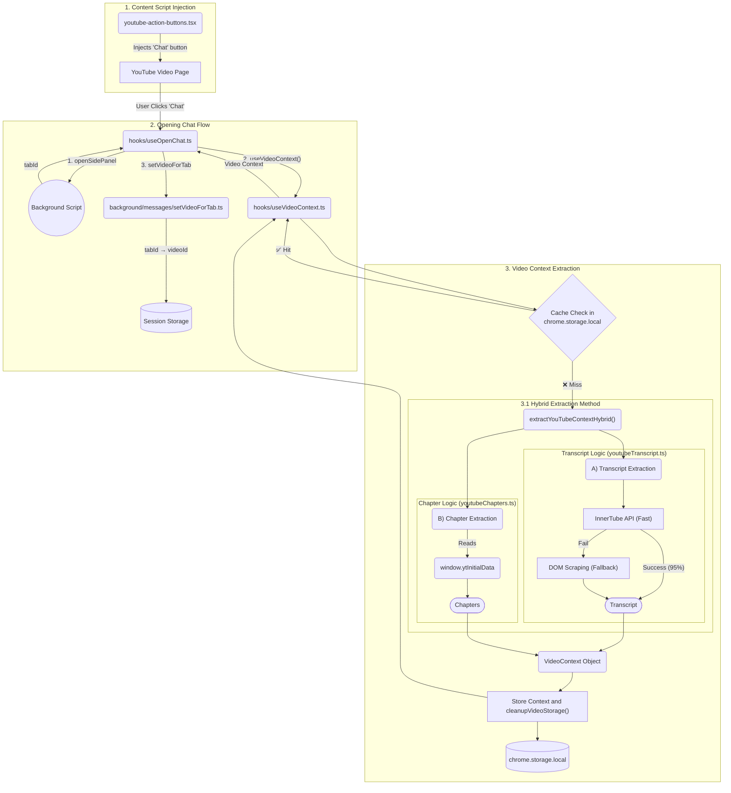

# NanoTutor Architecture Flow

## Architecture Visualization

## 1. Content Script Injection
**File:** `youtube-action-buttons.tsx`

Content script that injects a Chat button into YouTube's video page using Plasmo's `getInlineAnchor` API. The button is positioned inline with YouTube's native buttons (Like, Share, etc.) via `ytd-menu-renderer` selector.

## 2. Opening Chat (`useOpenChat` hook)
**File:** `hooks/useOpenChat.ts`

When user clicks the Chat button, the hook orchestrates a 3-step process:

1. **Open Side Panel** - Sends `openSidePanel` message to background script, receives `tabId`
2. **Extract Video Context** - Calls `useVideoContext()` hook to get transcript + chapters
3. **Map Video to Tab** - Sends `setVideoForTab` message to link videoId with current tab

## 3. Video Context Extraction (`useVideoContext` hook)
**File:** `hooks/useVideoContext.ts`

Extracts YouTube video data with intelligent caching:

- **Cache Check**: Looks for `videoContext_${videoId}` in storage
- **Cache Hit** ✅: Returns instantly (no extraction needed)
- **Cache Miss** ❌: Extracts transcript/chapters via `extractYouTubeContextHybrid()`
  - Runs `cleanupVideoStorage()` before saving (removes oldest 10 videos if 50+ exist)
  - Stores complete `VideoContext` object (~50-500KB per video)

**Storage Strategy:**
- Uses `chrome.storage.local` (10MB limit)
- Keeps max 50 videos cached
- Trade-off: Storage space for instant access

### 3.1. Hybrid Extraction Method (`extractYouTubeContextHybrid`)
**File:** `utils/youtubeTranscriptHybrid.ts`

The extraction process uses two parallel data sources:

**A) Transcript Extraction - InnerTube API (Fast Method + Fallback)**

1. **Fast Method (~100-300ms)**: Calls YouTube's internal InnerTube API (`fetchFirstAvailableTranscript`)
   - Makes direct API request to YouTube's caption endpoint
   - Retrieves first available subtitle track (auto-generated or manual)
   - 95%+ success rate
   
2. **Fallback (~5-10s)**: If API fails, falls back to DOM scraping
   - Opens YouTube's transcript panel via button clicks
   - Scrapes text from rendered transcript elements
   - Covers edge cases where API is unavailable

**B) Chapter Extraction - ytInitialData Object (Instant)**

File: `utils/youtubeChapters.ts`

Extracts chapters from YouTube's page data object (`window.ytInitialData`):
- Navigates JSON path: `ytInitialData → playerOverlays → decoratedPlayerBarRenderer → markersMap`
- Supports two chapter types:
  - **DESCRIPTION_CHAPTERS**: Manual chapters added by creator (preferred)
  - **AUTO_CHAPTERS**: AI-generated chapters by YouTube
- No HTTP requests needed (~5-10ms extraction time)
- Returns empty array if video has no chapters

**Result:** Complete `VideoContext` object with transcript (50-500KB) + chapters array

## 4. Video-Tab Relationship (`setVideoForTab` background message)
**File:** `background/messages/setVideoForTab.ts`

Stores `tabId → videoId` mapping in session storage. This allows each browser tab to maintain its own side panel context, enabling multiple videos to be open simultaneously with independent chat sessions.

**Key:** Tab ID (number) → **Value:** Video ID (string)  
**Storage:** Session (cleared on browser close)