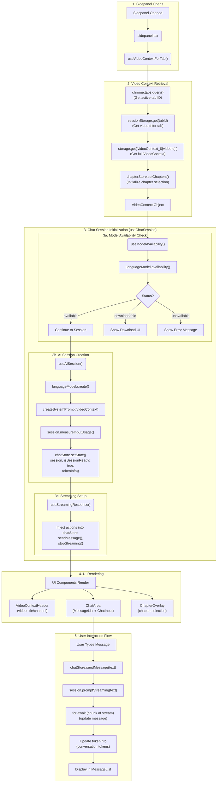
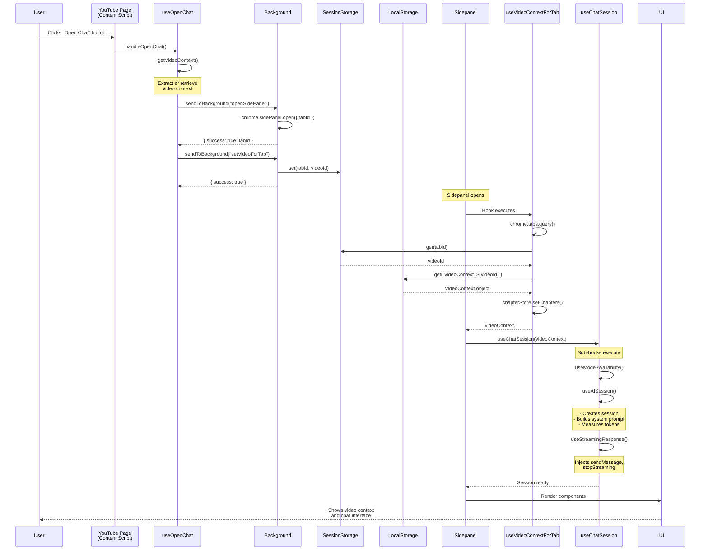
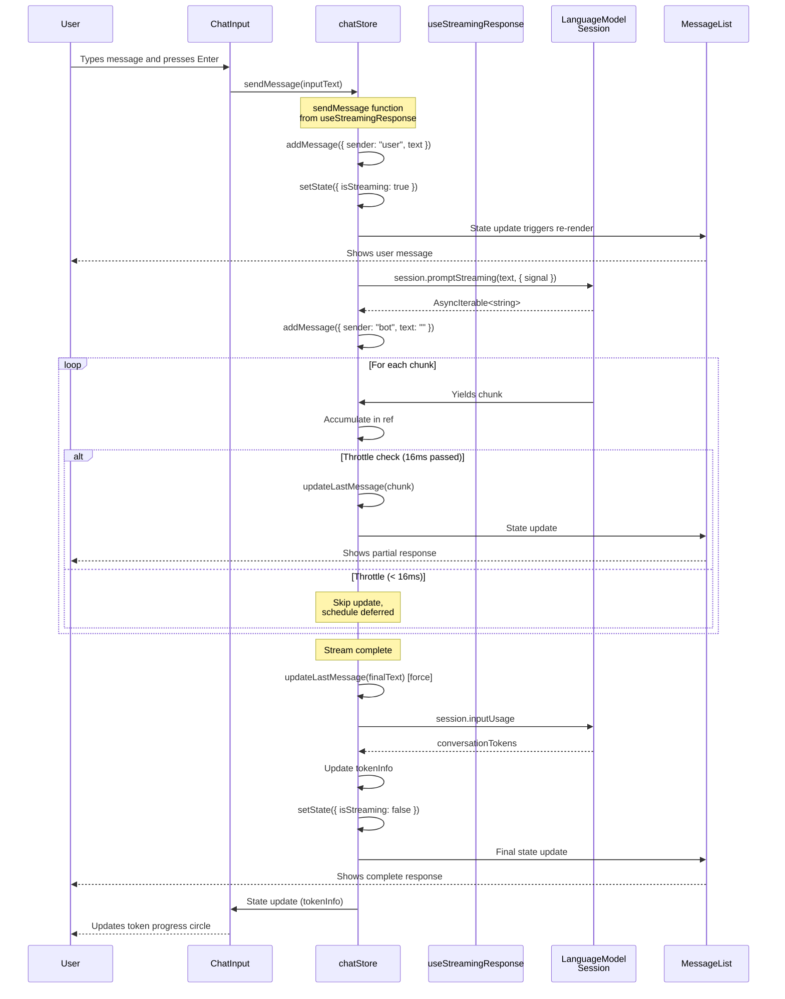

# Sidepanel Flow and Chat Session Architecture

## Architecture Visualization



---

## 1. Sidepanel Entry Point

**File:** [`sidepanel.tsx`](../src/sidepanel.tsx)

The root component that initializes when the sidepanel opens. It orchestrates the entire chat experience through two key hooks:

```typescript
function SidePanel() {
  // Retrieve video context for the current tab
  const videoContext = useVideoContextForTab()

  // Initialize chat session with video context
  useChatSession(videoContext)

  return (
    <div>
      <VideoContextHeader />
      <ChatArea />
      <ChapterOverlay />
    </div>
  )
}
```

**Execution Order:**
1. `useVideoContextForTab()` fetches video data
2. `useChatSession(videoContext)` initializes AI session
3. Components render with data from stores

---

## 2. Video Context Retrieval for Tab

**File:** [`hooks/videoContext/useVideoContextForTab.ts`](../src/hooks/videoContext/useVideoContextForTab.ts)

### Purpose
Retrieves the video context for the current browser tab by looking up the tab→video mapping.

### Storage Architecture

The extension uses a two-tier storage strategy:

```
Session Storage (Temporary - cleared on tab close)
┌─────────────────────────────────────────┐
│ Key: tabId (string)                     │
│ Value: videoId (string)                 │
│                                         │
│ Example:                                │
│ "12345" → "dQw4w9WgXcQ"                │
└─────────────────────────────────────────┘

Local Storage (Persistent - survives restart)
┌─────────────────────────────────────────┐
│ Key: "videoContext_{videoId}"           │
│ Value: VideoContext object              │
│                                         │
│ Example:                                │
│ "videoContext_dQw4w9WgXcQ" → {         │
│   videoId: "dQw4w9WgXcQ",              │
│   transcript: "...",                    │
│   title: "Never Gonna Give You Up",    │
│   chapters: [...],                      │
│   ...                                   │
│ }                                       │
└─────────────────────────────────────────┘
```

**Why Two Layers?**
- **Session Storage**: Enables multi-tab support - each tab can have its own video
- **Local Storage**: Enables video caching - revisiting videos loads instantly

### Hook Flow

```typescript
async function useVideoContextForTab() {
  // 1. Get the current active tab ID
  const [tab] = await chrome.tabs.query({
    active: true,
    currentWindow: true
  })
  const tabId = tab?.id

  // 2. Look up videoId for this tab (session storage)
  const videoId = await sessionStorage.get(tabId.toString())

  // 3. Retrieve full VideoContext using videoId (local storage)
  const videoContext = await storage.get(`videoContext_${videoId}`)

  // 4. Initialize chapter store with chapters from context
  if (videoContext?.chapters) {
    setChapters(videoContext.chapters)
  }

  return videoContext
}
```

### VideoContext Structure

**File:** [`types/transcript.ts`](../src/types/transcript.ts)

```typescript
interface VideoContext {
  videoId: string           // YouTube video ID
  transcript?: string       // Full transcript text (50-500KB)
  title: string            // Video title
  url: string              // Full YouTube URL
  channel: string          // Channel name
  timestamp: number        // Extraction timestamp
  error?: string           // Error message if transcript unavailable
  chapters?: Chapter[]     // Array of video chapters
}

interface Chapter {
  title: string            // Chapter title
  startSeconds: number     // Timestamp in seconds
}
```

**Size:** Typically 50-500KB per video (mostly transcript text)

---

## 3. Chat Session Initialization

**File:** [`hooks/chat/useChatSession.ts`](../src/hooks/chat/useChatSession.ts)

### Purpose
Orchestrates the initialization of the complete chat system by coordinating multiple specialized hooks.

### Hook Composition

```typescript
function useChatSession(videoContext: VideoContext | null) {
  const transcript = videoContext?.transcript

  // 1. Check model availability (download if needed)
  const availability = useModelAvailability()

  // 2. Create AI session with video context
  useAISession({
    videoContext,
    shouldInitialize: availability === "available" && !!transcript
  })

  // 3. Set up message streaming handlers
  useStreamingResponse()

  // 4. Update derived state
  useEffect(() => {
    // Update hasUserMessages flag
    const hasUserMessages = messages.some(m => m.sender === "user")

    // Update hasTranscriptError flag
    const hasTranscriptError = !transcript && !!videoContext

    useChatStore.setState({ hasUserMessages, hasTranscriptError })
  }, [messages, transcript, videoContext])
}
```

**Why This Design?**
- **Single Responsibility**: Each hook handles one concern
- **Composability**: Hooks can be reused independently
- **Testability**: Each hook can be tested in isolation

---

## 4. Model Availability Management

**File:** [`hooks/chat/useModelAvailability.ts`](../src/hooks/chat/useModelAvailability.ts)

### Purpose
Manages the Chrome built-in AI model (Gemini Nano) availability and download process.

### Availability States

```typescript
type Availability =
  | "available"      // Model ready to use
  | "downloadable"   // Model can be downloaded
  | "downloading"    // Download in progress
  | "unavailable"    // Model not supported
  | null            // Not checked yet
```

### Hook Flow

```typescript
useEffect(() => {
  async function checkAvailability() {
    // 1. Check if Prompt API exists
    const apiAvailable = "ai" in self && "languageModel" in self.ai
    if (!apiAvailable) {
      useChatStore.setState({
        availability: "unavailable",
        apiAvailable: false
      })
      return
    }

    // 2. Check model status
    const status = await self.ai.languageModel.availability()
    useChatStore.setState({
      availability: status,
      apiAvailable: true
    })
  }

  checkAvailability()
}, [])
```

### Model Download Function

```typescript
async function startDownload() {
  useChatStore.setState({ availability: "downloading" })

  try {
    // Create session with progress monitoring
    const session = await self.ai.languageModel.create({
      monitor(m) {
        m.addEventListener("downloadprogress", (e) => {
          // Update progress bar (0-1)
          useChatStore.setState({
            downloadProgress: e.loaded / e.total
          })
        })
      }
    })

    // Model downloaded and extracting
    useChatStore.setState({ isExtracting: true })

    // Wait for extraction to complete
    await session.ready

    // Cleanup and mark as available
    session.destroy()
    useChatStore.setState({
      availability: "available",
      isExtracting: false
    })

  } catch (error) {
    useChatStore.setState({ availability: "downloadable" })
  }
}

// Inject download function into store
useChatStore.setState({ startDownload })
```

**UI Integration:** The `ModelDownload` component displays download button and progress bar based on `availability` and `downloadProgress` from store.

---

## 5. AI Session Creation

**File:** [`hooks/chat/useAISession.ts`](../src/hooks/chat/useAISession.ts)

### Purpose
Creates and manages the Chrome AI LanguageModel session, including system prompt injection and token tracking.

### Session Creation Process

```typescript
async function createSession(context?: VideoContext) {
  // 1. Create base session
  const session = await self.ai.languageModel.create({
    temperature: 1,
    topK: 3
  })

  // 2. Build system prompt from video context
  const systemPrompt = await createSystemPrompt(context, session)

  // 3. Measure system prompt tokens
  const systemTokens = await session.measureInputUsage(systemPrompt)
  const inputQuota = session.maxTokens

  // 4. Update store with session and token info
  useChatStore.setState({
    session,
    isSessionReady: true,
    tokenInfo: {
      systemTokens,
      conversationTokens: 0,
      totalTokens: systemTokens,
      inputQuota,
      percentageUsed: (systemTokens / inputQuota) * 100
    }
  })

  return session
}
```

### System Prompt Builder

**File:** [`utils/systemPrompt.ts`](../src/utils/systemPrompt.ts)

```typescript
async function createSystemPrompt(
  context: VideoContext | undefined,
  session: LanguageModelSession
): Promise<string> {
  if (!context?.transcript) {
    return "You are a helpful assistant."
  }

  const transcript = context.transcript

  // 1. Estimate tokens (rough approximation)
  const estimatedTokens = Math.ceil(transcript.length / 4)

  // 2. Calculate 80% of available quota (leave room for conversation)
  const maxSystemTokens = Math.floor(session.maxTokens * 0.8)

  // 3. Truncate if necessary
  let finalTranscript = transcript
  if (estimatedTokens > maxSystemTokens) {
    const ratio = maxSystemTokens / estimatedTokens
    const maxLength = Math.floor(transcript.length * ratio)
    finalTranscript = transcript.slice(0, maxLength) +
                      "\n\n[Transcript truncated due to length]"
  }

  // 4. Build prompt
  const prompt = `You are an assistant that answers questions about the video: "${context.title}".

Here is the transcript:

${finalTranscript}`

  // 5. Append to session (session maintains context)
  await session.append([{ role: "system", content: prompt }])

  return prompt
}
```

**Token Management:**
- Uses 80% of context window for system prompt (video transcript)
- Reserves 20% for conversation (user + assistant messages)
- Truncates transcript if it exceeds quota

### Session Reset

```typescript
async function resetSession() {
  // 1. Destroy old session
  session?.destroy()

  // 2. Clear messages
  useChatStore.setState({
    messages: [],
    isSessionReady: false
  })

  // 3. Create new session
  const newSession = await createSession(videoContext)

  // Session is ready again with fresh context
}

// Inject reset function into store
useChatStore.setState({ handleResetSession: resetSession })
```

---

## 6. Message Streaming

**File:** [`hooks/chat/useStreamingResponse.ts`](../src/hooks/chat/useStreamingResponse.ts)

### Purpose
Handles sending user messages and streaming AI responses with real-time updates.

### Streaming Architecture

```typescript
async function sendMessage(text: string, options?: { displayText?: string }) {
  const session = useChatStore.getState().session
  if (!session) return

  // 1. Add user message to chat
  const userMessage: Message = {
    id: Date.now(),
    text: options?.displayText || text,
    sender: "user"
  }
  addMessage(userMessage)

  // 2. Clear input and set streaming state
  useChatStore.setState({
    inputText: "",
    isStreaming: true
  })

  // 3. Create abort controller (for stop button)
  const abortController = new AbortController()
  abortControllerRef.current = abortController

  // 4. Start streaming
  try {
    const stream = await session.promptStreaming(text, {
      signal: abortController.signal
    })

    // 5. Add empty bot message
    const botMessage: Message = {
      id: Date.now() + 1,
      text: "",
      sender: "bot"
    }
    addMessage(botMessage)

    // 6. Accumulate and update message
    streamingMessageRef.current = ""

    for await (const chunk of stream) {
      // Get incremental chunk
      const newChunk = chunk.slice(streamingMessageRef.current.length)
      streamingMessageRef.current = chunk

      // Throttled update (max 60 FPS)
      updateStreamingMessage()
    }

    // 7. Final update (force)
    updateStreamingMessage(true)

    // 8. Update token tracking
    const conversationTokens = session.inputUsage
    const systemTokens = useChatStore.getState().tokenInfo.systemTokens
    const totalTokens = systemTokens + conversationTokens
    const inputQuota = session.maxTokens

    useChatStore.setState({
      tokenInfo: {
        systemTokens,
        conversationTokens,
        totalTokens,
        inputQuota,
        percentageUsed: (totalTokens / inputQuota) * 100
      }
    })

  } catch (error) {
    if (error.name === "AbortError") {
      // User clicked stop button
      updateStreamingMessage(true) // Finalize partial response
    } else {
      // Error occurred
      addMessage({
        id: Date.now() + 1,
        text: "Sorry, an error occurred.",
        sender: "bot"
      })
    }
  } finally {
    useChatStore.setState({ isStreaming: false })
    abortControllerRef.current = null
  }
}
```

### Throttled Updates (60 FPS Optimization)

```typescript
const lastUpdateTimeRef = useRef(0)
const updateTimeoutRef = useRef<NodeJS.Timeout>()

function updateStreamingMessage(force = false) {
  const now = Date.now()
  const timeSinceLastUpdate = now - lastUpdateTimeRef.current

  // Throttle to 60 FPS (16ms between updates)
  if (!force && timeSinceLastUpdate < 16) {
    // Schedule deferred update
    clearTimeout(updateTimeoutRef.current)
    updateTimeoutRef.current = setTimeout(() => {
      updateStreamingMessage(true)
    }, 16 - timeSinceLastUpdate)
    return
  }

  // Update last message with accumulated text
  const text = streamingMessageRef.current
  updateLastMessage(text)

  lastUpdateTimeRef.current = now
}
```

**Why Throttle?**
- AI can stream very fast (hundreds of tokens per second)
- Updating DOM on every chunk causes performance issues
- 60 FPS (16ms) is smooth enough for human perception

### Stop Streaming

```typescript
function stopStreaming() {
  if (abortControllerRef.current) {
    abortControllerRef.current.abort()
  }
}

// Inject actions into store
useChatStore.setState({
  sendMessage,
  stopStreaming
})
```

---

## 7. State Management (Zustand Stores)

### Store 1: Chat Store

**File:** [`stores/chatStore.ts`](../src/stores/chatStore.ts)

```typescript
interface ChatStore {
  // === Message State ===
  messages: Message[]               // Chat history
  inputText: string                 // Current input value

  // === Session State ===
  session: LanguageModelSession | null  // AI session instance
  isSessionReady: boolean           // Session initialized
  isStreaming: boolean              // Currently streaming response

  // === Model Availability ===
  availability: Availability | null  // Model status
  downloadProgress: number          // Download progress (0-1)
  isExtracting: boolean             // Extracting after download
  apiAvailable: boolean | null      // Prompt API available

  // === Token Tracking ===
  tokenInfo: {
    systemTokens: number            // System prompt tokens
    conversationTokens: number      // User + assistant tokens
    totalTokens: number             // Sum of above
    inputQuota: number              // Max tokens allowed
    percentageUsed: number          // 0-100%
  }

  // === UI State ===
  hasUserMessages: boolean          // User has sent at least one message
  hasTranscriptError: boolean       // Transcript extraction failed
  isOpeningChat: boolean            // Opening chat from YouTube
  openChatError: string | null      // Error opening chat

  // === Actions (Injected by Hooks) ===
  sendMessage: (text: string, options?: { displayText?: string }) => Promise<void>
  handleResetSession: () => Promise<void>
  stopStreaming: () => void
  startDownload: () => Promise<void>

  // === Basic Actions ===
  setInputText: (text: string) => void
  setMessages: (messages: Message[]) => void
  addMessage: (message: Message) => void
  updateLastMessage: (text: string) => void
}
```

**Action Injection Pattern:**

Hooks create async functions with access to refs and closures, then inject them into the store:

```typescript
// Inside useStreamingResponse hook
useChatStore.setState({
  sendMessage: async (text) => {
    // Function has access to hook's refs and state
    const stream = await session.promptStreaming(text)
    // ...
  }
})
```

**Benefits:**
- Actions can use React refs (for abort controllers, throttling)
- Actions automatically have access to latest state
- Components get strongly-typed actions from store

### Store 2: Chapter Store

**File:** [`stores/chapterStore.ts`](../src/stores/chapterStore.ts)

```typescript
interface ChapterStore {
  // === Chapter Data ===
  chapters: Chapter[]               // All available chapters
  selectedChapters: number[]        // Indices of selected chapters

  // === UI State ===
  showPanel: boolean                // Chapter selection overlay visible
  rangeInput: string                // Range input value (e.g., "1-3,5-8")

  // === Actions ===
  setChapters: (chapters: Chapter[]) => void
  togglePanel: () => void
  toggleChapter: (index: number) => void
  selectAll: () => void
  deselectAll: () => void
  setRangeInput: (value: string) => void
  applyRange: (range?: string) => void
  reset: () => void

  // === Derived State (Computed) ===
  isAllSelected: () => boolean
  selectedCount: () => number
}
```

**Default Behavior:**

```typescript
setChapters: (chapters) => {
  // When chapters are set, select all by default
  const allIndices = chapters.map((_, i) => i)
  set({
    chapters,
    selectedChapters: allIndices
  })
}
```

**Range Selection:**

```typescript
applyRange: (range?: string) => {
  // Parse range like "1-3,5-8" or "1,3,5"
  const rangeStr = range ?? get().rangeInput
  const indices = parseRangeInput(rangeStr, get().chapters.length)

  set({ selectedChapters: indices })
}

// Example: "1-3,5-8" → [0,1,2,4,5,6,7] (zero-indexed)
```

---

## 8. Message Flow & Background Communication

### Tab Lifecycle Management

**File:** [`background/index.ts`](../src/background/index.ts)

#### 1. Enable/Disable Sidepanel Based on URL

```typescript
chrome.tabs.onUpdated.addListener(async (tabId, changeInfo, tab) => {
  if (changeInfo.status === "complete" && tab.url) {
    const url = new URL(tab.url)

    if (url.origin === "https://www.youtube.com") {
      // Enable sidepanel for YouTube
      await chrome.sidePanel.setOptions({
        tabId,
        enabled: true
      })
    } else {
      // Disable for other sites
      await chrome.sidePanel.setOptions({
        tabId,
        enabled: false
      })
    }
  }
})
```

#### 2. Handle Video Navigation (History State Changes)

```typescript
chrome.webNavigation.onHistoryStateUpdated.addListener(async (details) => {
  // User navigated to different video without page reload
  const newUrl = new URL(details.url)
  const newVideoId = newUrl.searchParams.get("v")

  // Check if video changed
  const currentVideoId = await sessionStorage.get(details.tabId.toString())

  if (currentVideoId && currentVideoId !== newVideoId) {
    // Video changed - reset sidepanel by toggling
    await chrome.sidePanel.setOptions({
      tabId: details.tabId,
      enabled: false
    })
    await chrome.sidePanel.setOptions({
      tabId: details.tabId,
      enabled: true
    })

    // Clear old tab→video mapping
    await sessionStorage.remove(details.tabId.toString())
  }
})
```

**Why Reset?** When user navigates to a different video, the sidepanel should show the new video's context, not the old one.

#### 3. Cleanup on Tab Close

```typescript
chrome.tabs.onRemoved.addListener(async (tabId) => {
  // Remove tab→video mapping
  await sessionStorage.remove(tabId.toString())

  // Note: Video context stays in local storage
  // (video-centric caching, not tab-centric)
})
```

### Message Handlers

#### Open Sidepanel Handler

**File:** [`background/messages/openSidePanel.ts`](../src/background/messages/openSidePanel.ts)

```typescript
export default async (
  req: PlasmoMessaging.Request,
  res: PlasmoMessaging.Response
) => {
  const tabId = req.sender.tab?.id

  if (!tabId) {
    return res.send({ success: false, error: "No tab ID" })
  }

  // Open sidepanel for this tab
  await chrome.sidePanel.open({ tabId })

  // Return tab ID for caller to use
  res.send({ success: true, tabId })
}
```

#### Set Video for Tab Handler

**File:** [`background/messages/setVideoForTab.ts`](../src/background/messages/setVideoForTab.ts)

```typescript
export default async (
  req: PlasmoMessaging.Request<{ videoId: string }>,
  res: PlasmoMessaging.Response
) => {
  const tabId = req.sender.tab?.id
  const videoId = req.body.videoId

  if (!tabId || !videoId) {
    return res.send({ success: false })
  }

  // Map tab → video in session storage
  await sessionStorage.set(tabId.toString(), videoId)

  res.send({ success: true })
}
```

### Opening Chat from YouTube Page

**File:** [`hooks/useOpenChat.ts`](../src/hooks/useOpenChat.ts)

```typescript
async function handleOpenChat() {
  useChatStore.setState({ isOpeningChat: true, openChatError: null })

  try {
    // 1. Extract/retrieve video context
    const videoContext = await getVideoContext()

    if (!videoContext) {
      throw new Error("Failed to extract video context")
    }

    // 2. Open sidepanel
    const response = await sendToBackground({
      name: "openSidePanel"
    })

    if (!response.success) {
      throw new Error("Failed to open sidepanel")
    }

    // 3. Map tab to video
    await sendToBackground({
      name: "setVideoForTab",
      body: { videoId: videoContext.videoId }
    })

    useChatStore.setState({ isOpeningChat: false })

  } catch (error) {
    useChatStore.setState({
      isOpeningChat: false,
      openChatError: error.message
    })
  }
}
```

---

## 9. UI Components

### Component Hierarchy

```
SidePanel (root)
├── VideoContextHeader
├── ChatArea
│   ├── availability !== "available"
│   │   └── ModelDownload
│   │       ├── Download Button
│   │       └── Progress Bar
│   └── availability === "available"
│       ├── MessageList
│       │   └── MessageItem[] (map over messages)
│       └── ChatInput
│           ├── ChapterSelectionHeader (compact)
│           ├── Textarea (auto-resize)
│           ├── Reset Button (with token progress circle)
│           ├── Stop Button (during streaming)
│           └── Send Button / Loading Spinner
└── ChapterOverlay
    └── ChapterSelectionPanel
        ├── Header (Select All/None)
        ├── Range Input
        └── Chapter List (checkboxes)
```

### Component 1: VideoContextHeader

**File:** [`components/chat/video-context/VideoContextHeader.tsx`](../src/components/chat/video-context/VideoContextHeader.tsx)

**Purpose:** Displays video metadata and transcript extraction errors.

```typescript
function VideoContextHeader() {
  const videoContext = useVideoContextForTab()

  if (!videoContext) {
    return <Spinner>Waiting for video context...</Spinner>
  }

  return (
    <div>
      <h2>{videoContext.title}</h2>
      <p>{videoContext.channel}</p>

      {videoContext.error && (
        <ErrorMessage>
          Sorry, no available transcripts for this video.
        </ErrorMessage>
      )}
    </div>
  )
}
```

**States:**
- **Loading:** Shows spinner
- **Success:** Shows title + channel
- **Error:** Shows title + channel + error message

### Component 2: ChatArea

**File:** [`components/chat/ChatArea.tsx`](../src/components/chat/ChatArea.tsx)

**Purpose:** Container that switches between model download UI and chat interface.

```typescript
function ChatArea() {
  const availability = useChatStore(state => state.availability)

  if (availability !== "available") {
    return <ModelDownload />
  }

  return (
    <div>
      <MessageList />
      <ChatInput />
    </div>
  )
}
```

### Component 3: ModelDownload

**File:** [`components/chat/model_init/ModelDownload.tsx`](../src/components/chat/model_init/ModelDownload.tsx)

**Purpose:** Shows model download UI with progress tracking.

```typescript
function ModelDownload() {
  const { availability, downloadProgress, isExtracting, startDownload } =
    useChatStore()

  if (availability === "unavailable") {
    return <ErrorMessage>Model not supported on this device</ErrorMessage>
  }

  if (availability === "downloading" || isExtracting) {
    return (
      <div>
        <ProgressBar value={downloadProgress} />
        <p>
          {isExtracting
            ? "Extracting model..."
            : `Downloading: ${Math.round(downloadProgress * 100)}%`
          }
        </p>
      </div>
    )
  }

  // availability === "downloadable"
  return (
    <button onClick={startDownload}>
      Download AI Model
    </button>
  )
}
```

### Component 4: MessageList

**File:** [`components/chat/messages/MessageList.tsx`](../src/components/chat/messages/MessageList.tsx)

**Purpose:** Renders chat history with auto-scroll.

```typescript
function MessageList() {
  const messages = useChatStore(state => state.messages)
  const messagesEndRef = useRef<HTMLDivElement>(null)

  // Auto-scroll to bottom on new messages
  useEffect(() => {
    messagesEndRef.current?.scrollIntoView({ behavior: "smooth" })
  }, [messages])

  return (
    <div className="message-list">
      {messages.map(message => (
        <MessageItem key={message.id} message={message} />
      ))}
      <div ref={messagesEndRef} />
    </div>
  )
}
```

### Component 5: MessageItem

**File:** [`components/chat/messages/MessageItem.tsx`](../src/components/chat/messages/MessageItem.tsx)

**Purpose:** Renders individual message with Markdown support.

```typescript
function MessageItem({ message }: { message: Message }) {
  return (
    <div className={`message message-${message.sender}`}>
      <ReactMarkdown
        remarkPlugins={[remarkGfm]}
        disallowedElements={['script', 'iframe', 'object', 'embed']}
      >
        {message.text}
      </ReactMarkdown>
    </div>
  )
}
```

**Styling:**
- **User messages:** Blue background, right-aligned
- **Bot messages:** White background with border, left-aligned

### Component 6: ChatInput

**File:** [`components/chat/ChatInput.tsx`](../src/components/chat/ChatInput.tsx)

**Purpose:** Input area with send/reset/stop buttons and token usage indicator.

```typescript
function ChatInput() {
  const {
    inputText,
    isStreaming,
    isSessionReady,
    hasUserMessages,
    tokenInfo,
    sendMessage,
    stopStreaming,
    handleResetSession,
    setInputText
  } = useChatStore()

  const chapters = useChapterStore(state => state.chapters)

  const handleSubmit = async (e: React.FormEvent) => {
    e.preventDefault()
    if (!inputText.trim() || isStreaming) return
    await sendMessage(inputText)
  }

  return (
    <form onSubmit={handleSubmit}>
      {chapters.length > 0 && (
        <ChapterSelectionHeader variant="compact" />
      )}

      <textarea
        value={inputText}
        onChange={(e) => setInputText(e.target.value)}
        placeholder="Ask a question about the video..."
        rows={3}
      />

      <div className="button-row">
        {/* Reset button with token progress circle */}
        {hasUserMessages && (
          <Tooltip content={
            `Context Window Usage:\n` +
            `System: ${tokenInfo.systemTokens} tokens\n` +
            `Conversation: ${tokenInfo.conversationTokens} tokens\n` +
            `Total: ${tokenInfo.totalTokens} / ${tokenInfo.inputQuota} ` +
            `(${tokenInfo.percentageUsed.toFixed(1)}%)`
          }>
            <button
              type="button"
              onClick={handleResetSession}
              className="reset-button"
            >
              <CircularProgress value={tokenInfo.percentageUsed} />
              <RotateCcw />
            </button>
          </Tooltip>
        )}

        {/* Stop button (during streaming) */}
        {isStreaming && (
          <button type="button" onClick={stopStreaming}>
            <Pause />
          </button>
        )}

        {/* Send button / Loading spinner */}
        {!isSessionReady ? (
          <LoadingSpinner />
        ) : (
          <button type="submit" disabled={!inputText.trim() || isStreaming}>
            <Send />
          </button>
        )}
      </div>
    </form>
  )
}
```

**Features:**
1. **Auto-resize textarea** (3 rows minimum)
2. **Token usage indicator** with circular progress and tooltip
3. **Stop button** appears during streaming
4. **Loading state** while session initializes
5. **Chapter selection header** (if chapters available)

### Component 7: ChapterSelectionHeader

**File:** [`components/chat/chapters/ChapterSelectionHeader.tsx`](../src/components/chat/chapters/ChapterSelectionHeader.tsx)

**Purpose:** Compact button showing selected chapter count, opens chapter panel.

```typescript
function ChapterSelectionHeader({
  variant = "default"
}: {
  variant?: "default" | "compact" | "micro" | "auto"
}) {
  const { chapters, selectedCount, togglePanel } = useChapterStore()

  // Auto variant: measure available space and choose label
  const [label, setLabel] = useState("full")
  const measureRef = useRef<HTMLDivElement>(null)

  useEffect(() => {
    if (variant !== "auto") return

    const measure = () => {
      const containerWidth = measureRef.current?.offsetWidth ?? 0

      if (containerWidth < 100) setLabel("micro")    // "3/8"
      else if (containerWidth < 200) setLabel("short") // "3 of 8 selected"
      else setLabel("full")                            // "3 of 8 chapters selected"
    }

    measure()
    window.addEventListener("resize", measure)
    return () => window.removeEventListener("resize", measure)
  }, [variant])

  const text =
    label === "micro"
      ? `${selectedCount()}/${chapters.length}`
      : label === "short"
      ? `${selectedCount()} of ${chapters.length} selected`
      : `${selectedCount()} of ${chapters.length} chapters selected`

  return (
    <button onClick={togglePanel} ref={measureRef}>
      <List />
      {text}
    </button>
  )
}
```

### Component 8: ChapterOverlay + ChapterSelectionPanel

**Files:**
- [`components/chat/chapters/ChapterOverlay.tsx`](../src/components/chat/chapters/ChapterOverlay.tsx)
- [`components/chat/chapters/ChapterSelectionPanel.tsx`](../src/components/chat/chapters/ChapterSelectionPanel.tsx)

**Purpose:** Slide-in panel for selecting which chapters to include in chat context.

```typescript
function ChapterOverlay() {
  const showPanel = useChapterStore(state => state.showPanel)

  if (!showPanel) return null

  return (
    <div className="overlay" onClick={() => togglePanel()}>
      <ChapterSelectionPanel
        onClick={(e) => e.stopPropagation()}
      />
    </div>
  )
}

function ChapterSelectionPanel() {
  const {
    chapters,
    selectedChapters,
    rangeInput,
    toggleChapter,
    selectAll,
    deselectAll,
    setRangeInput,
    applyRange,
    isAllSelected
  } = useChapterStore()

  return (
    <div className="panel">
      {/* Header */}
      <div className="header">
        <button onClick={selectAll}>Select All</button>
        <button onClick={deselectAll}>None</button>
      </div>

      {/* Range Input */}
      <input
        type="text"
        value={rangeInput}
        onChange={(e) => setRangeInput(e.target.value)}
        onKeyDown={(e) => e.key === "Enter" && applyRange()}
        placeholder="e.g., 1-3,5-8"
      />
      <button onClick={() => applyRange()}>Apply Range</button>

      {/* Chapter List */}
      <div className="chapter-list">
        {chapters.map((chapter, index) => (
          <label key={index}>
            <input
              type="checkbox"
              checked={selectedChapters.includes(index)}
              onChange={() => toggleChapter(index)}
            />
            <span>{chapter.title}</span>
            <span className="timestamp">
              {formatTime(chapter.startSeconds)}
            </span>
          </label>
        ))}
      </div>
    </div>
  )
}
```

**Features:**
1. **Select All / None** - Quick actions
2. **Range Input** - Bulk selection (e.g., "1-3,5-8")
3. **Individual Checkboxes** - Fine-grained control
4. **Visual Feedback** - Selected chapters highlighted

**Note:** Currently UI-only. Selected chapters don't yet filter the context sent to AI. This could be a future enhancement where only selected chapter transcripts are included in the system prompt.

---

## 10. Complete Sequence Diagrams

### Opening the Sidepanel



### Sending a Message



---

## 11. Key Design Patterns

### 1. Centralized State with Zustand
- **Single source of truth** for all state
- **Direct updates** via `useChatStore.setState()`
- **Selective subscriptions** via selectors (optimized re-renders)

```typescript
// Hook updates store directly
useChatStore.setState({ isStreaming: true })

// Component subscribes to specific state
const messages = useChatStore(state => state.messages)
```

### 2. Async Action Injection
- Hooks create async functions with closures
- Functions injected into store as actions
- Components call actions from store

```typescript
// Hook injects action
useChatStore.setState({
  sendMessage: async (text) => {
    // Has access to hook's refs and closures
  }
})

// Component calls action
const sendMessage = useChatStore(state => state.sendMessage)
await sendMessage("Hello")
```

**Benefits:**
- Actions can use React refs (abort controllers, throttling)
- Actions automatically see latest state
- Type-safe action signatures

### 3. Hook Composition
- `useChatSession` orchestrates multiple hooks
- Each hook has single responsibility
- Clean separation of concerns

```typescript
useChatSession() {
  useModelAvailability()    // Check/download model
  useAISession()            // Create session
  useStreamingResponse()    // Handle messages
}
```

### 4. Two-Tier Storage
- **Session Storage**: Temporary tab→video mapping
- **Local Storage**: Persistent video→context cache

**Benefits:**
- Multi-tab support (each tab has own video)
- Fast retrieval (cached contexts)
- Clean separation (tab-specific vs. video-specific)

### 5. Token Management
- Tracks system prompt separately from conversation
- Reserves 80% for context, 20% for conversation
- Visual indicator (circular progress)
- Reset functionality when approaching limit

### 6. Streaming Optimization
- Throttles updates to 60 FPS (16ms)
- Prevents performance issues from rapid updates
- Force-updates at end for final accuracy

### 7. Progressive Enhancement
- Shows model download UI if unavailable
- Graceful degradation with error messages
- Handles transcript extraction failures

---

## 12. File Structure Summary

```
src/
├── sidepanel.tsx                              # Entry point
│
├── hooks/
│   ├── chat/
│   │   ├── useChatSession.ts                  # Orchestrator
│   │   ├── useModelAvailability.ts            # Model check/download
│   │   ├── useAISession.ts                    # Session creation
│   │   └── useStreamingResponse.ts            # Message streaming
│   ├── videoContext/
│   │   ├── useVideoContext.ts                 # Extract from YouTube
│   │   └── useVideoContextForTab.ts           # Retrieve for tab
│   └── useOpenChat.ts                         # Open from content script
│
├── stores/
│   ├── chatStore.ts                           # Chat state (Zustand)
│   └── chapterStore.ts                        # Chapter selection
│
├── components/
│   └── chat/
│       ├── ChatArea.tsx                       # Main container
│       ├── ChatInput.tsx                      # Input + buttons
│       ├── video-context/
│       │   └── VideoContextHeader.tsx         # Video info header
│       ├── messages/
│       │   ├── MessageList.tsx                # Message container
│       │   └── MessageItem.tsx                # Message bubble
│       ├── chapters/
│       │   ├── ChapterOverlay.tsx             # Backdrop
│       │   ├── ChapterSelectionPanel.tsx      # Selection UI
│       │   └── ChapterSelectionHeader.tsx     # Compact toggle
│       └── model_init/
│           └── ModelDownload.tsx              # Download UI
│
├── background/
│   ├── index.ts                               # Event listeners
│   └── messages/
│       ├── openSidePanel.ts                   # Open handler
│       └── setVideoForTab.ts                  # Mapping handler
│
├── types/
│   ├── message.ts                             # Message interface
│   ├── transcript.ts                          # VideoContext types
│   └── chrome-ai.d.ts                         # Chrome AI types
│
└── utils/
    ├── storage.ts                             # Storage helpers
    ├── systemPrompt.ts                        # Prompt builder
    └── constants.ts                           # Config constants
```

---

## Summary

The sidepanel and chat architecture demonstrates a well-designed system with:

1. **Clear Data Flow**: Video context flows from storage → sidepanel → AI session
2. **Modular Hooks**: Each hook handles a specific concern (availability, session, streaming)
3. **Centralized State**: Zustand stores provide single source of truth
4. **Performance Optimization**: Throttled streaming updates, efficient re-renders
5. **Multi-Tab Support**: Session storage enables independent chats per tab
6. **Robust Error Handling**: Graceful degradation at each step
7. **Token Management**: Tracks and visualizes context window usage

The system elegantly separates **data retrieval** (storage, Chrome APIs), **business logic** (React hooks), **state management** (Zustand), and **UI rendering** (React components), making it maintainable and extensible.
